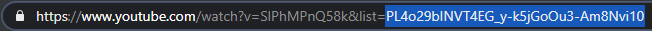
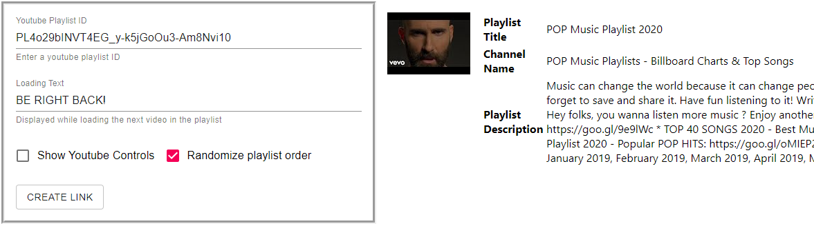

# [Try The App Here](https://genide.github.io/youtube-playlist-brb)

## Why I Made This

In my free time, I like to stream video games on twtich.  
But sometimes I need to step away from the stream for various reasons  
When I do this, I like to leave some clips up for the viewers.  
But it can get a bit repititive showing the exact same "Be Right Back" video everytime.  
So I decided to change it up by randomizing what clips they see each time I go away.  

## How To Use The App

Go to youtube and find the playlist you want to use as your "Be Right Back" playlist. 
You can find the youtube playlist ID after the "list" query parameter in your URL. 

 

Click on the link above to take you to the github page.  
It will show a configuration screen that allows you to enter a youtube playlist id.  
Enter the youtube playlist ID into the configuration form and click "Create Link".  

 

 
A URL with be copied to your clipboard and you'll be sent to the new "Be Right Back" website.  
It will begin playing the videos in the playlist according to the configuration you specified.  
With the link copied, you can then add this webpage to your "Be Right Back" scene in your favorite streaming application.  

 
 

## Available Scripts

In the project directory, you can run:

### `yarn start`

Runs the app in the development mode. 
Open [http://localhost:3000](http://localhost:3000) to view it in the browser.

The page will reload if you make edits. 
You will also see any lint errors in the console.

### `yarn test`

Launches the test runner in the interactive watch mode. 
See the section about [running tests](https://facebook.github.io/create-react-app/docs/running-tests) for more information.

### `yarn build`

Builds the app for production to the `build` folder. 
It correctly bundles React in production mode and optimizes the build for the best performance.

The build is minified and the filenames include the hashes. 
Your app is ready to be deployed!

See the section about [deployment](https://facebook.github.io/create-react-app/docs/deployment) for more information.

### `yarn eject`

**Note: this is a one-way operation. Once you `eject`, you can’t go back!**

If you aren’t satisfied with the build tool and configuration choices, you can `eject` at any time. This command will remove the single build dependency from your project.

Instead, it will copy all the configuration files and the transitive dependencies (webpack, Babel, ESLint, etc) right into your project so you have full control over them. All of the commands except `eject` will still work, but they will point to the copied scripts so you can tweak them. At this point you’re on your own.

You don’t have to ever use `eject`. The curated feature set is suitable for small and middle deployments, and you shouldn’t feel obligated to use this feature. However we understand that this tool wouldn’t be useful if you couldn’t customize it when you are ready for it.

## Learn More

You can learn more in the [Create React App documentation](https://facebook.github.io/create-react-app/docs/getting-started).

To learn React, check out the [React documentation](https://reactjs.org/).

This project was bootstrapped with [Create React App](https://github.com/facebook/create-react-app).
